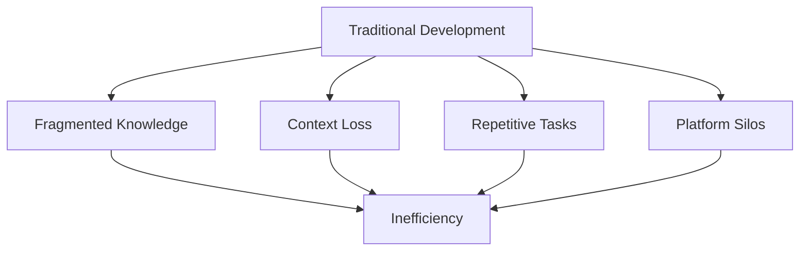
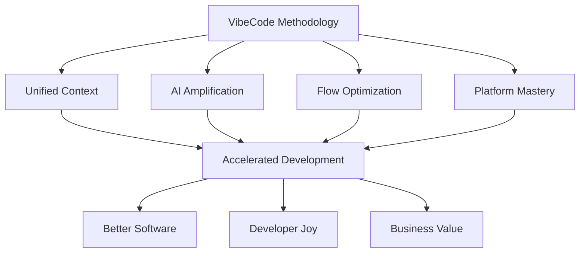

# 🌟 Introduction to VibeCode

Welcome to **VibeCode** - a revolutionary development methodology that transforms the way you build software. Born from the intersection of human creativity and artificial intelligence, VibeCode represents the next evolution in development practices.

## 🎯 What is Vibe Coding?

Vibe Coding is more than just a development methodology - it's a philosophy that harmonizes **intuitive flow** with **systematic rigor**. It recognizes that the best software emerges when developers are in their optimal state: focused, creative, and supported by intelligent tools.

### Core Philosophy

```markdown
"The best code is written when the developer is in flow,
 the requirements are crystal clear,
 and the tools amplify human creativity."
```

VibeCode achieves this through three fundamental pillars:

1. **🎨 Flow State Development** - Creating environments where creativity thrives
2. **🧠 Context Engineering** - Systematic approach to clarity and precision  
3. **🤖 AI-Amplified Productivity** - Leveraging AI as a force multiplier

## 🚀 The Evolution of Development

### Traditional Development Challenges



**Pain Points We Solve:**
- **Context Switching Overhead** - Constant mental model rebuilding
- **Knowledge Fragmentation** - Information scattered across platforms
- **Repetitive Boilerplate** - Time wasted on routine tasks
- **Platform Learning Curves** - Starting from scratch for each technology
- **Quality vs Speed Trade-offs** - Pressure to compromise standards

### The VibeCode Solution



## 🎪 Core Principles

### 1. Flow-First Development

**Create optimal conditions for deep work:**
- Minimize context switching
- Automate routine tasks
- Design distraction-free environments
- Optimize for sustained focus periods

### 2. Context Engineering

**Build systematic clarity:**
- Three-layer context framework (System, Domain, Task)
- PRP Methodology (Problem, Requirements, Platform)
- Living documentation that evolves with code
- Explicit knowledge capture and sharing

### 3. AI as Co-Pilot

**Amplify human creativity:**
- AI handles boilerplate and routine tasks
- Human focuses on architecture and creativity
- Continuous learning and adaptation
- Quality enhancement through AI assistance

### 4. Platform-Native Excellence

**Master the art of platform optimization:**
- Understand each platform's unique strengths
- Use the right tool for the right job
- Build for platform-specific user expectations
- Optimize for platform performance characteristics

### 5. Quality by Design

**Embed excellence from the start:**
- Test-driven development as default
- Security-first mindset
- Performance optimization built-in
- Accessibility as a core requirement

## 🎭 The VibeCode Experience

### For Individual Developers

**Transform your daily work:**
- **Morning Setup** - AI assists with context restoration and planning
- **Development Flow** - Uninterrupted coding with intelligent assistance
- **Quality Assurance** - Automated testing and code review
- **Learning Integration** - Continuous skill development woven into workflow

### For Teams

**Scale excellence across your organization:**
- **Shared Context** - Team-wide knowledge management
- **Collaborative Flow** - Asynchronous deep work with synchronous alignment
- **Quality Standards** - Consistent excellence across all team members
- **Knowledge Sharing** - Systematic capture and distribution of learnings

### For Organizations

**Drive business outcomes through developer productivity:**
- **Faster Time-to-Market** - Accelerated development cycles
- **Higher Quality Products** - Built-in quality practices
- **Reduced Technical Debt** - Proactive architecture and refactoring
- **Improved Developer Retention** - More engaging and productive work environment

## 🌍 Why VibeCode Matters Now

### The AI Revolution in Development

We're at an inflection point where AI transforms from tool to partner. VibeCode provides the framework to navigate this transformation successfully:

- **Prompt Engineering Mastery** - Learn to communicate effectively with AI
- **Human-AI Collaboration** - Understand where humans excel vs. AI
- **Quality Amplification** - Use AI to enhance rather than replace human judgment
- **Continuous Learning** - Stay current with rapidly evolving AI capabilities

### Cross-Platform Reality

Modern software lives across multiple platforms:

- **Web Applications** - Progressive web apps, responsive design
- **Mobile Development** - iOS, Android, cross-platform solutions  
- **Desktop Applications** - Native apps, Electron, web-based
- **Cloud Services** - Microservices, serverless, container orchestration
- **Emerging Platforms** - AR/VR, IoT, blockchain applications

VibeCode provides unified principles that work across all platforms while respecting platform-specific best practices.

## 🎯 Getting Started: The VibeCode Journey

### Phase 1: Foundation (Weeks 1-2)
- **Understand the Methodology** - Core principles and philosophy
- **Set Up Your Environment** - Tools, AI assistants, workspace optimization
- **Learn Context Engineering** - Master the three-layer framework

### Phase 2: Application (Weeks 3-6)  
- **Choose Your Platform** - Start with your strongest area
- **Practice the Workflow** - AI-assisted development cycles
- **Build Sample Projects** - Apply methodology to real problems

### Phase 3: Mastery (Months 2-6)
- **Expand Platform Coverage** - Learn cross-platform development
- **Optimize Your Flow** - Personalize tools and processes
- **Share and Teach** - Help others adopt the methodology

### Phase 4: Innovation (Ongoing)
- **Experiment with New Tools** - Stay current with AI evolution
- **Contribute to Community** - Share learnings and improvements
- **Push Boundaries** - Explore new applications and platforms

## 🔥 What Makes VibeCode Different?

### vs. Traditional Methodologies

| Traditional | VibeCode |
|------------|----------|
| Process-heavy | Flow-optimized |
| Tool-agnostic | AI-integrated |
| Platform-specific | Cross-platform |
| Documentation as afterthought | Context engineering first |
| Individual heroics | Systematic excellence |

### vs. AI-First Approaches

| AI-First | VibeCode |
|----------|----------|
| Replace human thinking | Amplify human creativity |
| Generate everything | Generate strategically |
| Single AI assistant | Multi-AI orchestration |
| Speed over quality | Speed with quality |
| Black box decisions | Transparent reasoning |

## 🎉 Ready to Begin?

The VibeCode journey starts with a single step. Whether you're a:

- **👶 Beginner** - New to development but excited about AI-assisted coding
- **💼 Professional** - Experienced developer seeking productivity breakthroughs  
- **🏢 Team Lead** - Looking to transform team development practices
- **🎯 Entrepreneur** - Building products across multiple platforms

VibeCode has a path designed for you.

## 🚀 Next Steps

Choose your adventure:

1. **[Context Engineering →](../02-context-engineering/overview)** - Master the foundation
2. **[AI Workflow →](../03-ai-workflow/overview)** - Learn the implementation process  
3. **[Getting Started →](../getting-started/overview)** - Quick start guide
4. **[Web Development →](../04-web-development/overview)** - Platform-specific mastery

---

*"The future of development isn't about replacing developers with AI - it's about creating superhuman developers who wield AI as naturally as they breathe."*

**- Tushar Aggarwal, Creator of VibeCode**