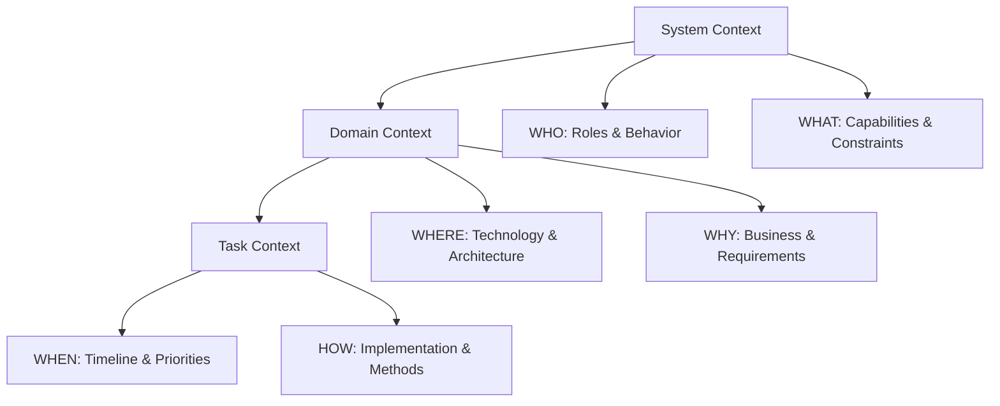
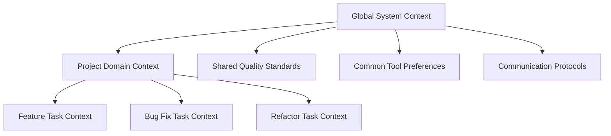

# 🧠 Context Engineering: The Foundation of Excellence

Context Engineering is the cornerstone of VibeCode methodology - a systematic approach to creating, maintaining, and leveraging context for superior development outcomes. It transforms chaotic development into organized excellence through structured thinking.

## 🎯 What is Context Engineering?

Context Engineering is the practice of deliberately constructing and maintaining the cognitive framework needed for effective development. It recognizes that **clarity precedes excellence** - the better your context, the better your code.

> **"Context is the invisible force that determines whether you build the right thing, the right way, at the right time."**

## 🏗️ The Three-Layer Context Framework

Context Engineering operates through three interconnected layers, each serving a specific purpose in the development process:



### Layer 1: System Context 🤖

**Purpose:** Define the AI assistant's role, capabilities, and behavioral parameters.

**Components:**
- **Role Definition** - Senior developer, architect, specialist
- **Expertise Areas** - Technologies, frameworks, patterns
- **Behavioral Guidelines** - Communication style, code quality standards
- **Output Format** - Documentation style, code conventions

**Example System Context:**
```yaml
role: "Senior Full-Stack Developer"
expertise: 
  - "JavaScript/TypeScript ecosystem"
  - "React, Next.js, Node.js"
  - "Cloud architecture (AWS/Azure)"
  - "DevOps and CI/CD"
behavior:
  - "Provide production-ready code with tests"
  - "Explain architectural decisions"
  - "Suggest performance optimizations"
  - "Include security considerations"
output_style:
  - "Clean, well-documented code"
  - "Comprehensive error handling"
  - "TypeScript with strict typing"
```

### Layer 2: Domain Context 🌍

**Purpose:** Establish the technological and business environment for the project.

**Components:**
- **Technology Stack** - Languages, frameworks, tools
- **Architecture Patterns** - Microservices, monolith, serverless
- **Business Domain** - E-commerce, fintech, healthcare
- **Quality Standards** - Testing requirements, performance criteria
- **Constraints** - Budget, timeline, platform limitations

**Example Domain Context:**
```yaml
technology_stack:
  frontend: "React 18 with TypeScript"
  backend: "Node.js with Express"
  database: "PostgreSQL with Prisma ORM"
  deployment: "Docker containers on AWS ECS"

architecture:
  pattern: "Microservices with API Gateway"
  communication: "REST APIs with GraphQL for complex queries"
  authentication: "JWT with refresh tokens"

business_domain: "E-commerce Platform"
requirements:
  performance: "< 2s page load, 99.9% uptime"
  security: "PCI DSS compliance required"
  scalability: "Handle 10k concurrent users"

constraints:
  timeline: "3 month MVP deadline"
  budget: "Limited to open-source tools"
  team_size: "2 developers, 1 designer"
```

### Layer 3: Task Context 🎯

**Purpose:** Define the specific work to be accomplished with clear success criteria.

**Components:**
- **Objective** - What needs to be built/fixed/improved
- **Requirements** - Functional and non-functional specifications
- **Acceptance Criteria** - Definition of done
- **Dependencies** - Prerequisites and constraints
- **Timeline** - Deadlines and milestones

**Example Task Context:**
```yaml
objective: "Implement user authentication system"

functional_requirements:
  - "User registration with email verification"
  - "Login with email/password"
  - "Password reset functionality"
  - "Social login (Google, GitHub)"
  - "Role-based access control"

non_functional_requirements:
  - "Response time < 500ms"
  - "GDPR compliant data handling"
  - "Accessible (WCAG 2.1 AA)"
  - "Mobile-responsive design"

acceptance_criteria:
  - "All authentication flows working"
  - "Unit tests with >90% coverage"
  - "Integration tests for all endpoints"
  - "Security audit passed"
  - "Documentation complete"

dependencies:
  - "User database schema finalized"
  - "Email service configured"
  - "SSL certificates installed"

timeline:
  - "Week 1: Core authentication"
  - "Week 2: Social login integration"
  - "Week 3: Security hardening & testing"
```

## 🔄 The PRP Methodology

Context Engineering employs the **PRP (Problem-Requirements-Platform)** methodology for systematic requirement discovery and solution design.

### P - Problem Definition

**Understand the real problem behind the request:**

```markdown
## Problem Analysis Template

### Surface Problem
- What the user/stakeholder says they need
- Immediate pain points mentioned
- Requested solution approach

### Root Problem  
- Underlying business/technical challenge
- Why this problem exists
- Impact if left unsolved

### Problem Context
- Who is affected and how
- When does this problem occur
- Current workarounds being used
```

**Example:**
```yaml
surface_problem: "Need a faster search feature"

root_problem: 
  - "Users abandon search after 3+ seconds"
  - "Current SQL queries don't scale"
  - "No indexing strategy for product catalog"

impact:
  - "20% drop in conversion for search users"
  - "Increased server costs from inefficient queries"
  - "Poor user experience affecting brand perception"
```

### R - Requirements Engineering

**Transform problems into clear, actionable requirements:**

```markdown
## Requirements Framework

### Functional Requirements
- Core features and capabilities
- User interactions and workflows
- Data processing and business logic

### Non-Functional Requirements
- Performance and scalability
- Security and compliance
- Usability and accessibility

### Technical Requirements
- Platform and technology constraints
- Integration requirements
- Deployment and maintenance needs
```

**Example:**
```yaml
functional_requirements:
  search_features:
    - "Full-text search across product catalog"
    - "Faceted filtering (category, price, brand)"
    - "Auto-complete with typo tolerance"
    - "Search result ranking by relevance"

  user_experience:
    - "Results appear as user types (debounced)"
    - "Visual indicators for search progress"
    - "Pagination for large result sets"

non_functional_requirements:
  performance:
    - "Search results in < 200ms"
    - "Handle 1000 concurrent searches"
    - "99.9% uptime during business hours"
  
  accessibility:
    - "Keyboard navigation support"
    - "Screen reader compatibility"
    - "Color contrast compliance"

technical_requirements:
  backend:
    - "Elasticsearch for search indexing"
    - "Redis for caching frequent queries"
    - "API rate limiting for abuse prevention"
    
  frontend:
    - "React with TypeScript"
    - "Debounced search input"
    - "Infinite scroll for results"
```

### P - Platform Selection

**Choose optimal technologies and architecture for the requirements:**

```markdown
## Platform Decision Framework

### Technology Evaluation
- Requirements fit and capabilities
- Performance characteristics
- Development velocity impact
- Ecosystem and community support

### Architecture Patterns
- Scalability and reliability
- Maintenance and operational overhead
- Team expertise and learning curve
- Integration with existing systems
```

**Example:**
```yaml
technology_choices:
  search_engine: 
    choice: "Elasticsearch"
    reasoning:
      - "Handles complex queries with high performance"
      - "Built-in analytics and monitoring"
      - "Excellent TypeScript support"
      - "Team has prior experience"
    
  caching_layer:
    choice: "Redis"
    reasoning:
      - "Sub-millisecond response times"
      - "Scales horizontally"
      - "Rich data structures for complex caching"
    
  frontend_state:
    choice: "React Query + Zustand"
    reasoning:
      - "Excellent caching and synchronization"
      - "Optimistic updates for better UX"
      - "Minimal boilerplate"

architecture_pattern:
  approach: "CQRS with Event Sourcing"
  reasoning:
    - "Separate read/write optimization"
    - "Audit trail for search analytics"
    - "Scalable query processing"
```

## 🛠️ Context Engineering Tools

### 1. Context Templates

**Standardized templates for consistent context creation:**

```markdown
# System Context Template
## AI Assistant Configuration
- Role: [Senior Developer/Architect/Specialist]
- Primary Technologies: [Languages, Frameworks, Tools]
- Code Quality Standards: [Testing, Documentation, Performance]
- Communication Style: [Detailed/Concise, Technical Level]

# Domain Context Template
## Project Environment
- Technology Stack: [Frontend, Backend, Database, DevOps]
- Architecture: [Patterns, Principles, Constraints]
- Business Domain: [Industry, Use Case, Requirements]
- Quality Criteria: [Performance, Security, Accessibility]

# Task Context Template
## Current Objective
- Goal: [What needs to be accomplished]
- Requirements: [Functional and Non-functional]
- Success Criteria: [Definition of done]
- Constraints: [Timeline, Resources, Dependencies]
```

### 2. Context Validation Checklist

**Ensure your context is complete and actionable:**

- [ ] **System Context Complete**
  - [ ] AI role clearly defined
  - [ ] Technology expertise specified
  - [ ] Quality standards established
  - [ ] Output format preferences set

- [ ] **Domain Context Comprehensive**
  - [ ] Technology stack documented
  - [ ] Architecture patterns chosen
  - [ ] Business requirements understood
  - [ ] Constraints identified

- [ ] **Task Context Specific**
  - [ ] Objectives clearly stated
  - [ ] Requirements detailed
  - [ ] Success criteria defined
  - [ ] Dependencies mapped

### 3. Context Evolution Tracking

**Keep context current as projects evolve:**

```yaml
context_version: "2.1"
last_updated: "2024-12-31"
changes:
  - "Added GraphQL requirement for mobile app"
  - "Updated performance targets for holiday traffic"
  - "Included GDPR compliance requirements"

review_schedule:
  - "Weekly during active development"
  - "Monthly during maintenance phase"
  - "Ad-hoc when requirements change"
```

## 🎯 Context Engineering Best Practices

### 1. Start with System Context

**Always establish AI capabilities before diving into specifics:**
- Define the AI's role and expertise
- Set quality and communication standards
- Establish output format preferences
- Create reusable templates for consistency

### 2. Iterate on Domain Context

**Refine understanding as the project evolves:**
- Begin with high-level architecture
- Add details as requirements clarify
- Update constraints as they change
- Document decisions and rationale

### 3. Be Specific with Task Context

**Avoid ambiguity in implementation tasks:**
- Use concrete, measurable requirements
- Include both positive and negative test cases
- Specify edge cases and error conditions
- Define clear acceptance criteria

### 4. Maintain Context Hygiene

**Keep context clean and current:**
- Remove outdated information promptly
- Consolidate related context elements
- Use version control for context documents
- Regular review and update cycles

## 🚀 Advanced Context Engineering

### Multi-AI Orchestration

**Coordinate multiple AI assistants with specialized contexts:**

```yaml
ai_team:
  architect:
    role: "System Architect"
    focus: "High-level design and patterns"
    context_depth: "System + Domain"
    
  frontend_dev:
    role: "Frontend Specialist" 
    focus: "UI/UX implementation"
    context_depth: "Domain + Task"
    
  backend_dev:
    role: "Backend Engineer"
    focus: "API and data layer"
    context_depth: "Domain + Task"
    
  qa_engineer:
    role: "Quality Assurance"
    focus: "Testing and validation"
    context_depth: "All layers"
```

### Context Inheritance Patterns

**Establish hierarchical context for complex projects:**



### Dynamic Context Adaptation

**Adjust context based on project phase:**

```yaml
project_phases:
  planning:
    emphasis: "System Context + High-level Domain"
    ai_behavior: "Ask clarifying questions"
    output_style: "Detailed analysis and options"
    
  development:
    emphasis: "Domain Context + Specific Tasks"
    ai_behavior: "Provide concrete implementations"
    output_style: "Production-ready code"
    
  maintenance:
    emphasis: "Task Context + Change Impact"
    ai_behavior: "Consider backward compatibility"
    output_style: "Minimal, focused changes"
```

## 🎪 Putting It All Together

Context Engineering transforms development from reactive problem-solving to proactive solution architecting. By systematically building and maintaining context, you create an environment where:

- **Requirements are crystal clear** before coding begins
- **AI assistants provide optimal help** because they understand the full picture
- **Code quality is consistent** across the entire project
- **Knowledge is preserved** and shared effectively
- **Decisions are documented** and rationale is clear

## 🔗 What's Next?

Now that you understand Context Engineering, you're ready to learn how to apply it in practice:

- **[AI Workflow →](../03-ai-workflow/overview)** - Learn the implementation process
- **[Getting Started →](../getting-started/overview)** - Quick start with real examples
- **[Web Development →](../04-web-development/overview)** - Platform-specific context patterns

---

*Context Engineering is the bridge between human intention and AI capability. Master it, and transform your development process forever.*