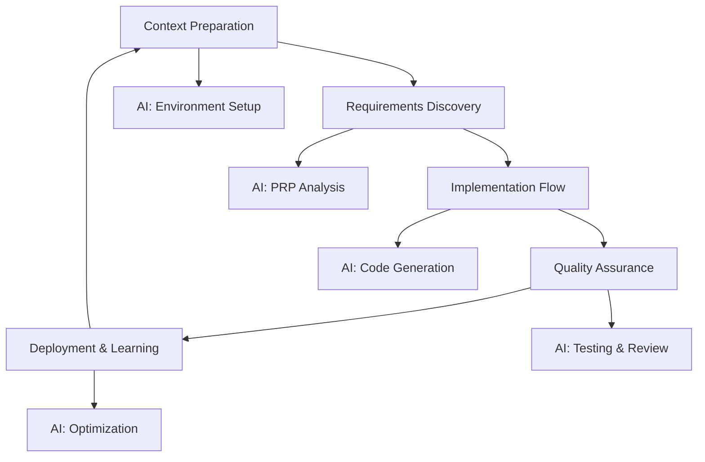

# 🤖 AI-Assisted Workflow: Where Theory Meets Practice

The AI-Assisted Workflow transforms VibeCode methodology from concept to reality through structured, AI-amplified development that delivers exceptional results while maintaining flow state.

## 🎯 The VibeCode Development Cycle



## 🚀 Phase 1: Context Preparation

### Environment Setup

**Essential VibeCode Toolkit:**
- **Primary AI**: Claude 3.5 Sonnet for architecture and complex reasoning
- **Code AI**: GitHub Copilot for real-time assistance
- **Specialized AI**: ChatGPT for quick queries, design tools for UI/UX
- **Development Environment**: VS Code with AI extensions

**AI Configuration Template:**
```yaml
role: "Senior Full-Stack Developer"
expertise: ["TypeScript", "React", "Node.js", "Cloud Architecture"]
behavior:
  - "Production-ready code with comprehensive testing"
  - "Security-first mindset with performance optimization"
  - "Clear documentation and architectural explanations"
quality_standards:
  testing: "90% coverage minimum"
  performance: "Core Web Vitals optimization"
  security: "OWASP compliance"
```

## 🔍 Phase 2: Requirements Discovery

### AI-Powered PRP Process

**Problem Analysis with AI:**
```markdown
"Analyze this problem using the 5-whys technique:
[PROBLEM_DESCRIPTION]

Provide:
1. Root cause analysis
2. Stakeholder impact assessment  
3. Business value quantification
4. Success metrics definition"
```

**Requirements Engineering:**
```markdown
"Generate comprehensive requirements for:
[PROBLEM_ANALYSIS]

Include:
- Functional requirements with user stories
- Non-functional requirements (performance, security, accessibility)
- Technical requirements and constraints
- Acceptance criteria and testing approach"
```

**Platform Selection:**
```markdown
"Recommend optimal technology stack considering:
- Technical requirements and constraints
- Team expertise and learning curve
- Performance and scalability needs
- Long-term maintainability and cost"
```

## 💻 Phase 3: Implementation Flow

### AI Collaboration Patterns

**Pattern 1: Architecture-First Development**
```typescript
// AI-Generated Implementation Example
interface SearchFilterProps {
  onSearch: (query: string, filters: SearchFilters) => void
  initialFilters?: SearchFilters
}

export const SearchFilter: React.FC<SearchFilterProps> = ({
  onSearch,
  initialFilters = {}
}) => {
  const [query, setQuery] = useState('')
  const [filters, setFilters] = useState(initialFilters)

  // Debounced search with AI-optimized performance
  const debouncedSearch = useCallback(
    debounce((searchQuery: string, searchFilters: SearchFilters) => {
      onSearch(searchQuery, searchFilters)
    }, 300),
    [onSearch]
  )

  // AI-generated effect management
  useEffect(() => {
    debouncedSearch(query, filters)
  }, [query, filters, debouncedSearch])

  return (
    <div className="search-filter">
      {/* AI-generated accessible UI components */}
      <input
        type="text"
        value={query}
        onChange={(e) => setQuery(e.target.value)}
        placeholder="Search..."
        aria-label="Search input"
      />
      {/* Filter components */}
    </div>
  )
}
```

**Pattern 2: Test-Driven Development**
```markdown
### AI TDD Process:
1. "Generate comprehensive tests for [FEATURE]"
2. "Implement code to make tests pass"
3. "Refactor for optimal performance and readability"
```

**Pattern 3: Code Review and Optimization**
```markdown
"Review this implementation for:
1. Code quality and best practices
2. Performance optimization opportunities
3. Security vulnerabilities  
4. Accessibility compliance"
```

## 🧪 Phase 4: Quality Assurance

### AI-Powered Testing

**Comprehensive Test Generation:**
```typescript
// AI-Generated Test Suite
describe('SearchFilter Component', () => {
  it('debounces search calls effectively', async () => {
    const mockOnSearch = vi.fn()
    render(<SearchFilter onSearch={mockOnSearch} />)
    
    const input = screen.getByRole('textbox')
    await userEvent.type(input, 'test query')
    
    expect(mockOnSearch).toHaveBeenCalledTimes(1)
    expect(mockOnSearch).toHaveBeenCalledWith('test query', {})
  })

  it('handles accessibility requirements', () => {
    render(<SearchFilter onSearch={vi.fn()} />)
    
    expect(screen.getByRole('textbox')).toHaveAttribute('aria-label')
    expect(screen.getByRole('button')).toHaveAttribute('aria-expanded')
  })
})
```

### Automated Code Review
```markdown
"Perform comprehensive code review:
- Security vulnerability scan
- Performance bottleneck analysis
- Accessibility compliance check
- Test coverage validation"
```

## 🚀 Phase 5: Deployment & Learning

### AI-Assisted DevOps

**Deployment Configuration:**
```yaml
deployment_strategy:
  development: "Vercel preview deployments"
  staging: "AWS ECS with health checks"
  production: "Blue-green deployment with auto-rollback"

monitoring:
  metrics: ["Performance", "Error rates", "User experience"]
  alerts: ["Critical failures", "Performance degradation"]
  dashboards: ["System overview", "Business metrics"]
```

### Continuous Learning

**AI-Powered Analysis:**
```markdown
"Analyze system performance and suggest optimizations:
1. Performance bottleneck identification
2. User experience enhancement opportunities
3. Code quality improvement recommendations
4. Architecture evolution suggestions"
```

## 🎪 Best Practices for AI Workflow

### 1. Context Management
- **Maintain Fresh Context**: Update AI with project changes regularly
- **Version Control Context**: Track context evolution alongside code
- **Share Context**: Ensure team alignment on AI configurations

### 2. AI Collaboration
- **Specific Prompts**: Be precise about requirements and constraints
- **Iterative Refinement**: Use AI for continuous improvement cycles
- **Human Oversight**: Review and validate all AI-generated content

### 3. Quality Assurance
- **Multi-Layer Testing**: Unit, integration, and E2E with AI assistance
- **Security First**: Regular AI-powered security analysis
- **Performance Focus**: Continuous optimization with AI insights

### 4. Learning Integration
- **Document Learnings**: Capture insights from each development cycle
- **Share Knowledge**: Build team knowledge base with AI assistance
- **Adapt Process**: Evolve workflow based on AI and team feedback

## 🔥 Common Workflow Patterns

### Daily Development Session
1. **Context Sync** (5 min) - Update AI with current state
2. **Task Planning** (10 min) - Break down work with AI assistance
3. **Implementation** (60-90 min) - Code with AI collaboration
4. **Review & Test** (20 min) - AI-assisted quality check
5. **Documentation** (10 min) - Update context and docs

### Weekly Review Cycle
1. **Performance Analysis** - AI reviews system metrics
2. **Code Quality Review** - AI suggests improvements
3. **Context Updates** - Refine AI configurations
4. **Learning Capture** - Document insights and patterns

## 🚀 Next Steps

Ready to implement the AI workflow? Choose your path:

- **[Web Development →](../04-web-development/overview)** - Platform-specific implementation
- **[Getting Started →](../getting-started/overview)** - Hands-on tutorial
- **[Context Engineering →](../02-context-engineering/overview)** - Deepen foundation knowledge

---

*The AI-Assisted Workflow is where VibeCode methodology comes alive. Master this process, and transform your development experience forever.*