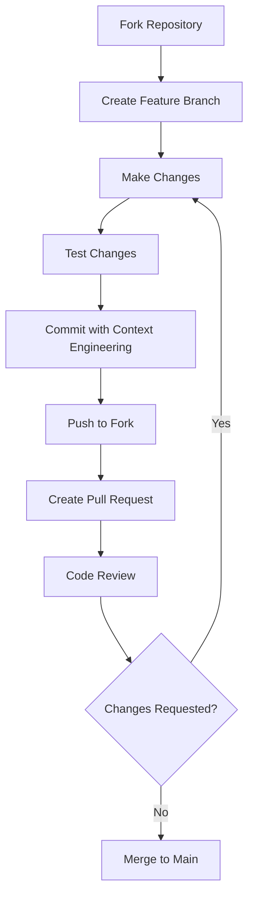

# 🤝 Contributing Guidelines & Community Standards

> *"Building an inclusive, collaborative community with Context Engineering principles"*

## 🎯 Overview

This section establishes **Contributing Guidelines & Community Standards** for the Vibe Coding guide project. These guidelines ensure a welcoming, productive environment for all contributors while maintaining quality through Context Engineering methodology.

---

## 📜 Code of Conduct

### Our Commitment

We pledge to make participation in our community a harassment-free experience for everyone, regardless of background, experience level, or identity. We are committed to acting in ways that contribute to an open, welcoming, diverse, and inclusive community.

### Expected Behavior

- **Be Respectful**: Treat all community members with dignity and respect
- **Be Inclusive**: Welcome newcomers and use inclusive language
- **Be Constructive**: Provide helpful feedback and focus on solutions
- **Be Professional**: Maintain appropriate behavior in all interactions
- **Be Patient**: Support those who are learning and developing skills

### Unacceptable Behavior

- Harassment, discrimination, or offensive language
- Personal attacks or trolling
- Publishing private information without permission
- Any conduct inappropriate in a professional setting

### Enforcement

Report issues to community moderators. Violations may result in temporary or permanent removal from the community.

---

## 🚀 How to Contribute

### Getting Started

1. **Read the Documentation**: Familiarize yourself with the Vibe Coding guide and Context Engineering methodology
2. **Check Existing Issues**: Look for open issues or discussions where you can contribute
3. **Join the Community**: Participate in discussions and introduce yourself
4. **Start Small**: Begin with documentation improvements or minor fixes

### Contribution Types

#### Documentation Contributions
- **Content Writing**: New sections, tutorials, or explanations
- **Editing**: Grammar, clarity, and style improvements
- **Translation**: Content in different languages
- **Examples**: Code samples and practical demonstrations

#### Technical Contributions
- **Code Examples**: Implementation samples across platforms
- **Templates**: Reusable Context Engineering templates
- **Tools**: Utilities and development aids
- **Testing**: Quality assurance and validation

### Contribution Process



#### Step-by-Step Process

1. **Fork the Repository**
   ```bash
   # Clone your fork
   git clone https://github.com/yourusername/vibecode.git
   cd vibecode
   ```

2. **Create Feature Branch**
   ```bash
   # Create branch with descriptive name
   git checkout -b feature/improve-react-section
   ```

3. **Make Your Changes**
   - Follow Context Engineering methodology
   - Use established writing style and format
   - Include practical examples where appropriate

4. **Test Your Changes**
   - Verify links work correctly
   - Check formatting and readability
   - Ensure Context Engineering alignment

5. **Commit Changes**
   ```bash
   # Use Context Engineering commit format
   git add .
   git commit -m "docs: improve React section with Context Engineering examples

   System Context: Enhanced developer learning experience
   Domain Context: React best practices and patterns
   Task Context: Added comprehensive component examples"
   ```

6. **Submit Pull Request**
   - Use descriptive title and detailed description
   - Reference related issues
   - Include Context Engineering rationale

---

## 📝 Style Guidelines

### Writing Standards

#### Tone and Voice
- **Clear and Concise**: Use simple, direct language
- **Professional but Friendly**: Maintain accessibility while being informative
- **Inclusive**: Use gender-neutral language and inclusive examples
- **Action-Oriented**: Focus on what readers can do and achieve

#### Content Structure
```markdown
# Section Title with Context Engineering Focus

> *"Brief, inspiring description of the section's value"*

## 🎯 Overview
Clear explanation of what this section covers

## 🚀 What You'll Learn/Master
- Bullet points of key outcomes
- Practical skills and knowledge
- Context Engineering integration

## Content Sections with Proper Headers
### Subsection with Clear Purpose
Detailed explanation with examples

#### Code Examples with Context
```typescript
// Context Engineering Example
interface ExampleInterface {
  // System Context: Clear purpose and role
  systemContext: SystemRequirements;
  
  // Domain Context: Technical constraints
  domainContext: TechnicalSpecs;
  
  // Task Context: Specific implementation
  taskContext: ImplementationDetails;
}
```

#### Documentation Format
- Use consistent heading hierarchy (H1 > H2 > H3 > H4)
- Include practical code examples
- Add Context Engineering templates where relevant
- Provide clear navigation links

### Code Style Guide

#### General Principles
- **Readability**: Code should be self-documenting
- **Consistency**: Follow established patterns throughout
- **Context Engineering**: Include three-layer methodology
- **Comments**: Explain the why, not just the what

#### Example Template
```typescript
// Context Engineering Code Template

// System Context Layer
interface SystemContext {
  role: string;
  guidelines: string[];
  standards: string[];
}

// Domain Context Layer  
interface DomainContext {
  technologies: string[];
  patterns: string[];
  constraints: string[];
}

// Task Context Layer
interface TaskContext {
  requirements: string[];
  objectives: string[];
  successCriteria: string[];
}

// Implementation with Context Engineering
class ContextEngineeredComponent {
  constructor(
    private system: SystemContext,
    private domain: DomainContext,
    private task: TaskContext
  ) {
    // Implementation follows all three context layers
  }
}
```

---

## 🔍 Review Process

### Quality Standards

All contributions must meet these standards:

#### Content Quality
- **Accuracy**: Technically correct and up-to-date information
- **Clarity**: Easy to understand for the target audience
- **Completeness**: Comprehensive coverage of the topic
- **Context Engineering**: Proper methodology integration

#### Technical Standards
- **Working Code**: All examples compile and run correctly
- **Best Practices**: Follows industry standards and conventions
- **Security**: No security vulnerabilities or bad practices
- **Performance**: Efficient and optimized implementations

### Review Workflow

1. **Automated Checks**: Links, formatting, and basic validation
2. **Peer Review**: Community member technical review
3. **Editorial Review**: Writing quality and consistency check
4. **Context Engineering Review**: Methodology compliance verification
5. **Final Approval**: Maintainer approval and merge

### Reviewer Guidelines

#### For Reviewers
- **Be Constructive**: Provide specific, actionable feedback
- **Be Thorough**: Check both content and technical accuracy
- **Be Encouraging**: Support contributor growth and learning
- **Be Timely**: Respond within 48 hours when possible

#### Review Checklist
- [ ] Content is accurate and up-to-date
- [ ] Context Engineering methodology properly applied
- [ ] Code examples work correctly
- [ ] Writing is clear and follows style guide
- [ ] Inclusive language used throughout
- [ ] Proper formatting and navigation links

---

## 👥 Community Roles

### Contributor Levels

#### New Contributors
- **Rights**: Submit pull requests, participate in discussions
- **Responsibilities**: Follow guidelines, accept feedback gracefully
- **Path Forward**: Consistent quality contributions lead to recognition

#### Regular Contributors  
- **Rights**: Review others' contributions, participate in decisions
- **Responsibilities**: Mentor newcomers, maintain quality standards
- **Recognition**: Listed in contributors section

#### Section Maintainers
- **Rights**: Approve changes in expertise areas, guide section direction
- **Responsibilities**: Ensure section quality, review related contributions
- **Requirements**: Demonstrated expertise and community involvement

#### Core Team
- **Rights**: Repository administration, final approval authority
- **Responsibilities**: Project direction, community management, conflict resolution
- **Requirements**: Long-term commitment and proven leadership

### Recognition System

#### Contribution Recognition
- **Contributors List**: GitHub contributors page and README acknowledgment
- **Expert Recognition**: Special recognition for significant contributions
- **Community Awards**: Monthly/quarterly recognition of outstanding contributors
- **Speaker Opportunities**: Conference and meetup speaking invitations

---

## 🛠️ Development Setup

### Local Development

```bash
# Clone repository
git clone https://github.com/vibecoding/vibecode.git
cd vibecode

# Install dependencies (if applicable)
npm install

# Start local development server
npm run dev

# View at http://localhost:3000
```

### Required Tools
- **Git**: Version control
- **Text Editor**: VS Code recommended with Markdown extensions
- **Browser**: For testing links and formatting
- **Node.js**: For development server (optional)

### Helpful Extensions
- **Markdown All in One**: VS Code extension for Markdown editing
- **markdownlint**: Markdown linting and style checking
- **Code Spell Checker**: Catch spelling errors
- **GitLens**: Enhanced Git capabilities

---

## 🤔 FAQ

### How do I get started contributing?
Start by reading existing documentation, joining discussions, and looking for "good first issue" labels. Begin with small improvements like fixing typos or adding examples.

### What if I'm not a native English speaker?
We welcome contributions from all language backgrounds! Focus on sharing your technical knowledge - our editorial team can help with language polishing.

### How do I suggest new sections or major changes?
Open a GitHub issue with your proposal, including Context Engineering rationale and community benefit. Discuss with the community before starting work.

### What if my contribution is rejected?
All feedback includes specific reasons and suggestions for improvement. Use the feedback to enhance your contribution and resubmit.

### How do I become a maintainer?
Consistent, high-quality contributions and active community participation naturally lead to increased responsibilities and recognition.

---

## 📞 Getting Help

### Community Support
- **GitHub Discussions**: General questions and community chat
- **GitHub Issues**: Bug reports and feature requests
- **Discord/Slack**: Real-time community communication (links in README)

### Mentorship Program
New contributors can request mentorship from experienced community members. Mentors provide guidance on:
- Understanding Context Engineering methodology
- Navigation of contribution process
- Technical writing best practices
- Career development in open source

### Contact Information
- **Project Maintainers**: Listed in README
- **Code of Conduct Issues**: [conduct@vibecoding.com](mailto:conduct@vibecoding.com)
- **General Questions**: GitHub Discussions

---

## 🎯 Quick Start Checklist

- [ ] Read Code of Conduct and Contributing Guidelines
- [ ] Join community discussions and introduce yourself
- [ ] Set up local development environment
- [ ] Find your first contribution (start with "good first issue")
- [ ] Follow the contribution process step-by-step
- [ ] Participate in review process and incorporate feedback
- [ ] Continue contributing and help others get started

---

**Next**: [Final Review & Integration](../25-final-review/README.md) | **Up**: [Table of Contents](../TOC.md)

*These guidelines ensure a welcoming, productive community that maintains high standards through Context Engineering methodology and collaborative development practices.*