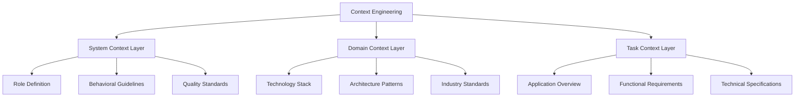

# 🧠 Context Engineering Fundamentals

**Context Engineering** is the systematic foundation that transforms AI-assisted development from experimental "vibe coding" to production-ready, enterprise-grade software development. It provides a structured approach to defining requirements, constraints, and expectations that guide both human and AI contributions.

## 🎯 What is Context Engineering?

Context Engineering is a three-layer framework that ensures **consistent, high-quality outcomes** in AI-assisted development:

> **"Context Engineering is 10x better than prompt engineering and 100x better than traditional vibe coding because it brings systematic structure to creative AI collaboration."** 
> 
> — Tushar Aggarwal, Creator of VibeCode

### The Problem It Solves
- **Inconsistent AI Outputs**: Random quality based on unclear prompts
- **Production Readiness Gap**: Code that works in demos but fails in production
- **Scalability Issues**: Processes that don't scale across teams or projects
- **Knowledge Fragmentation**: Context scattered across conversations and documents

### The Solution
A **systematic, layered approach** that provides:
- Clear role definitions and behavioral guidelines
- Comprehensive technical and domain specifications
- Detailed task requirements and constraints
- Reusable templates and patterns

## 🏗️ The Three-Layer Framework



### Layer 1: System Context 🤖
**Defines WHO your AI assistant is and HOW it should behave**

#### Role Definition
```yaml
Role: Senior Full-Stack Developer
Expertise: 8+ years in modern web development
Specialization: React, TypeScript, Node.js, AWS
Personality: Methodical, security-conscious, performance-focused
```

#### Behavioral Guidelines
- **Code Style**: Clean, readable, well-documented
- **Testing Approach**: Test-driven development with comprehensive coverage
- **Security Mindset**: Security-first implementation
- **Communication**: Explain decisions and provide alternatives

#### Quality Standards
- **Performance**: Sub-100ms API responses, 90+ Lighthouse scores
- **Security**: OWASP compliance, input validation, secure authentication
- **Maintainability**: SOLID principles, clear documentation
- **Testing**: 90%+ code coverage, unit + integration tests

### Layer 2: Domain Context 🌐
**Defines WHAT technologies and patterns to use**

#### Technology Stack
```yaml
Frontend:
  - Framework: React 18 with TypeScript
  - Styling: Tailwind CSS + Headless UI
  - State: Zustand for global state
  - Testing: Jest + React Testing Library

Backend:
  - Runtime: Node.js 18+ with TypeScript
  - Framework: Express.js with middleware
  - Database: PostgreSQL with Prisma ORM
  - Authentication: JWT with refresh tokens

Infrastructure:
  - Cloud: AWS (EC2, RDS, S3, CloudFront)
  - CI/CD: GitHub Actions
  - Monitoring: CloudWatch + Sentry
```

#### Architecture Patterns
- **Frontend**: Component-based architecture with custom hooks
- **Backend**: Layered architecture (routes → services → data)
- **Database**: Normalized relational design with migrations
- **API**: RESTful with consistent error handling

#### Industry Standards
- **Security**: HTTPS, CORS, rate limiting, input sanitization
- **Performance**: CDN, caching, image optimization
- **Accessibility**: WCAG 2.1 AA compliance
- **SEO**: Meta tags, structured data, sitemap

### Layer 3: Task Context 🎯
**Defines WHAT you're building and WHY**

#### Application Overview
```yaml
Project: TaskFlow - Personal Productivity App
Purpose: Help individuals manage tasks with intelligent prioritization
Target Users: Knowledge workers, entrepreneurs, students
Scale: 10K+ users, real-time collaboration
Platform: Web app with mobile PWA
```

#### Functional Requirements
- **Core Features**: Task CRUD, project organization, team collaboration
- **Advanced Features**: AI-powered prioritization, time tracking, analytics
- **User Interface**: Clean, intuitive design with keyboard shortcuts
- **Integration**: Calendar sync, email notifications, third-party tools

#### Technical Specifications
- **Performance**: Load under 2s, smooth 60fps animations
- **Scalability**: Handle 1M+ tasks, 100+ concurrent users
- **Security**: End-to-end encryption, OAuth integration
- **Deployment**: Blue-green deployments, auto-scaling

## 🚀 Implementation Process

### Step 1: Context Definition (15-30 minutes)
1. **System Context**: Define AI role and behavior
2. **Domain Context**: Specify tech stack and patterns
3. **Task Context**: Detail requirements and specifications

### Step 2: Template Creation (10-15 minutes)
Create reusable templates for:
- Project initialization prompts
- Code generation instructions
- Testing and validation criteria
- Deployment and maintenance guidelines

### Step 3: Iterative Refinement (Ongoing)
- **Feedback Integration**: Update context based on results
- **Pattern Recognition**: Identify reusable components
- **Quality Metrics**: Track success rates and improvements
- **Team Synchronization**: Share successful patterns

## 💡 Best Practices

### Context Definition
- **Be Specific**: Vague context leads to inconsistent results
- **Include Examples**: Show what good looks like
- **Set Constraints**: Define what NOT to do
- **Update Regularly**: Context evolves with project needs

### AI Collaboration
- **Clear Instructions**: Specific, actionable prompts
- **Incremental Requests**: Break complex tasks into steps
- **Validation Loops**: Test and refine outputs
- **Knowledge Transfer**: Document successful patterns

### Quality Assurance
- **Automated Testing**: Context-driven test generation
- **Code Reviews**: Human oversight of AI outputs
- **Performance Monitoring**: Real-world validation
- **Security Audits**: Regular security assessments

## 🎪 Advanced Techniques

### Context Inheritance
```yaml
Base Context:
  - Security: OWASP guidelines
  - Testing: TDD approach
  - Documentation: Comprehensive

Project-Specific Context:
  - Extends: Base Context
  - Technology: React + Express
  - Domain: E-commerce platform
```

### Dynamic Context Adaptation
- **Environment-Based**: Different contexts for dev/staging/prod
- **Feature-Based**: Specific contexts for different feature types
- **Team-Based**: Customized contexts for different team roles

### Context Validation
- **Automated Checks**: Validate context completeness
- **Success Metrics**: Track context effectiveness
- **A/B Testing**: Compare different context approaches

## 🛠️ Tools and Templates

### Context Engineering Templates
- **System Context Template**: Reusable AI role definitions
- **Domain Context Library**: Technology stack combinations
- **Task Context Generator**: Requirement specification tools

### Validation Tools
- **Context Checker**: Validate context completeness
- **Quality Metrics**: Track context effectiveness
- **Template Manager**: Version and share contexts

### Integration Tools
- **IDE Extensions**: Context-aware development
- **CI/CD Integration**: Context validation in pipelines
- **Team Collaboration**: Shared context repositories

## 🎯 Measuring Success

### Quality Metrics
- **Code Quality**: Complexity, maintainability scores
- **Bug Rates**: Defects per feature, time to resolution
- **Performance**: Load times, resource usage
- **Security**: Vulnerability counts, compliance scores

### Productivity Metrics
- **Development Speed**: Features per sprint, time to delivery
- **Context Reuse**: Template adoption, pattern consistency
- **Team Efficiency**: Onboarding time, knowledge sharing
- **AI Effectiveness**: Successful generations, iteration counts

### Business Impact
- **Time to Market**: Faster feature delivery
- **Cost Reduction**: Fewer bugs, less rework
- **Quality Improvement**: Higher user satisfaction
- **Team Satisfaction**: Better developer experience

## 🚀 Next Steps

Ready to implement Context Engineering in your projects?

1. **[Start with AI Workflow](../03-ai-workflow/overview)** - Learn the implementation process
2. **[Choose Your Platform](../04-web-development/overview)** - Apply to specific technologies
3. **[Join the Community](../17-community/overview)** - Share and learn from others
4. **[Contribute Templates](../24-contributing/overview)** - Help improve the methodology

---

**Transform your AI-assisted development today with Context Engineering!** 🎉